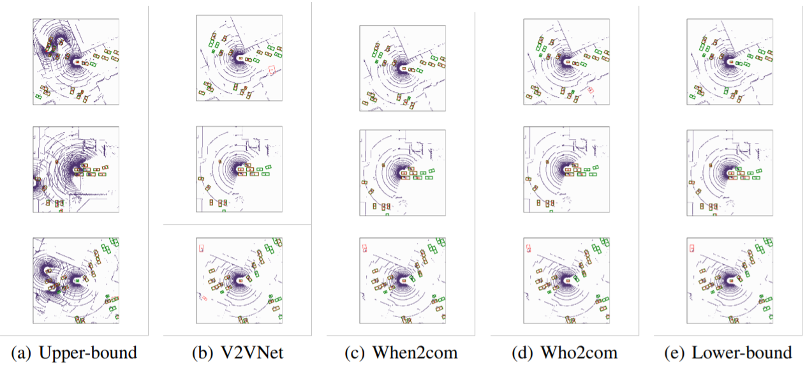

# Detection benchmark on V2XSIM

We implement lowerbound, upperbound, when2com, who2com, V2VNet as our benchmark detectors. Please see more details in our paper.

## Preparation

- Download V2XSIM datasets from our [website](https://ai4ce.github.io/V2X-Sim/index.html)
- Run the code below to generate preprocessed data

```bash
python create_data_det.py --root DATASET --split SPLIT --scene_start SCENE_START --scene_end SCENE_END --savepath PATH_TO_DATA

# --split [train/test]
# train: --scene_start 0 --scene_end 80
# test: --scene_start 90 --scene_end 100
```

- Add nuscenes-devkit dependency: ```export PYTHONPATH=nuscenes-devkit/python-sdk/:PYTHONPATH```

## Training

Train benchmark detectors:
*PATH_TO_DATA is where you put your preprocessed data*

```bash
# lowerbound
python train_det.py --data PATH_TO_DATA --bound lowerbound --log

# V2XNet
python train_det.py --data PATH_TO_DATA --bount lowerbound --com V2V --log

# when2com
python train_det.py --data PATH_TO_DATA --bound lowerbound --com when2com --log

# when2com_warp
python train_det.py --data PATH_TO_DATA --bound lowerbound --com when2com --warp_flag --log

# upperbound
python train_det.py --data PATH_TO_DATA --bound upperbound --log
```

## Evaluation

Evaluate benchmark detectors:

```bash
# lowerbound
python test_det.py --data PATH_TO_DATA --bound lowerbound --resume ./log/lowerbound/epoch_100.pth --tracking

# V2VNet
python test_det.py --data PATH_TO_DATA --bound lowerbound --resume ./log/V2V/epoch_100.pth --com V2V --tracking

# when2com
python test_det.py --data PATH_TO_DATA --bound lowerbound --resume ./log/when2com/epoch_100.pth --com when2com --inference activated --tracking

# who2com
python test_det.py --data PATH_to_DATA --bound lowerbound --resume ./log/when2com/epoch_100.pth --com when2com --inference argmax_test --tracking

# when2com_warp
python test_det.py --data PATH_TO_DATA --bound lowerbound --resume ./log/when2com_warp/epoch_100.pth --com when2com --inference activated --warp_flag --tracking

# who2com_warp
python test_det.py --data PATH_TO_DATA --bound lowerbound --resume ./log/when2com_warp/epoch_100.pth --com when2com --inference argmax_test --warp_flag --tracking

# upperbound
python test_det.py --data PATH_TO_DATA --bound upperbound --resume ./log/upperbound/epoch_100.pth --tracking
```


## Results




| Method | Lower-bound | When2com | When2com* | Who2com | Who2com* | V2VNet | Upper-bound |
| :----: | :---------: | :------: | :-------: | :-----: | :------: | :----: | :---------: |
| AP@0.5 |    50.42    |  55.85   |   56.39   |  54.81  |  52.35   | 56.76  |    63.29    |
| AP@0.7 |    45.06    |  52.44   |   52.97   |  52.53  |  49.07   | 53.79  |    61.41    |

