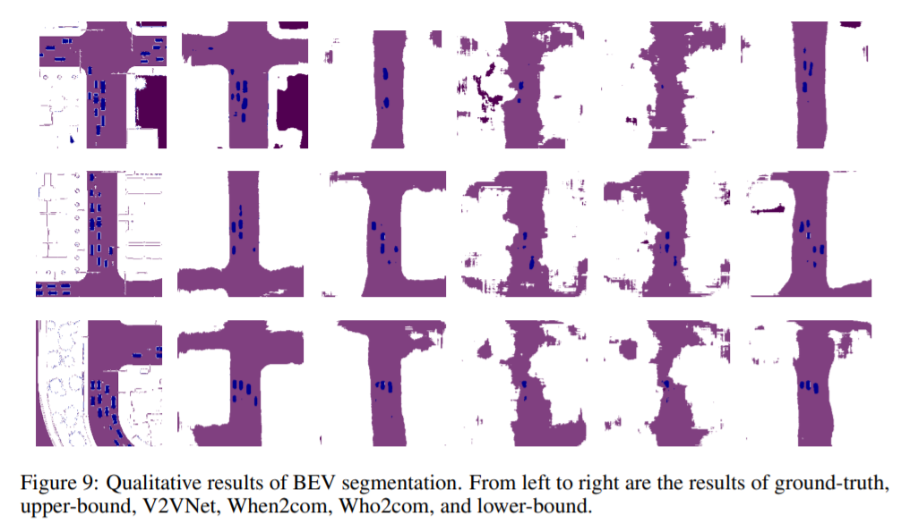

## Segmentation benchmark on V2XSIM

We implement lowerbound, upperbound, when2com, who2com, V2VNet as our benchmark segmentation methods. Please see more details in our paper.

## Preparation

- Download V2XSIM datasets from our [website](https://ai4ce.github.io/V2X-Sim/index.html)
- Run the code below to generate preprocessed data

```bash
python create_data_seg.py --root DATASET --split SPLIT --scene_start SCENE_START --scene_end SCENE_END --savepath PATH_TO_DATA -mode MODE

# --split [train/test]
# train: --scene_start 0 --scene_end 80
# test: --scene_start 90 --scene_end 100
# --mode [lowerbound/upperbound]
```

- Add nuscenes-devkit dependency: ```export PYTHONPATH=nuscenes-devkit/python-sdk/:PYTHONPATH```

## Training

Train benchmark segmentation methods:
*PATH_TO_DATA is where you put your preprocessed data*

```bash
# lowerbound
python train_seg.py --data PATH_TO_DATA --bound lowerbound --log

# V2VNet
python train_seg.py --data PATH_TO_DATA --bound lowerbound --com V2V --log

# when2com
python train_seg.py --data PATH_TO_DATA --bound lowerbound --com when2com --log

# when2com_warp
python train_seg.py --data PATH_TO_DATA --bound lowerbound --com when2com --warp_flag --log

# upperbound
python train_seg.py --data PATH_TO_DATA --bound upperbound --log
```

## Evaluation

Evaluate benchmark segmentation methods
```bash
# lowerbound
python test_seg.py --data PATH_TO_DATA --bound lowerbound --resume ./log/lowerbound/epoch_100.pth

# V2V
python test_seg.py --data PATH_TO_DATA --bound lowerbound --resume ./log/V2V/epoch_100.pth --com V2V

# when2com
python test_seg.py --data PATH_TO_DATA --bound lowerbound --resume ./log/when2com/epoch_100.pth --com when2com --inference activated

# who2com
python test_seg.py --data PATH_TO_DATA --bound lowerbound --resume ./log/when2com/epoch_100.pth --com when2com --inference argmax_test

# when2com_warp
python test_seg.py --data PATH_TO_DATA --bound lowerbound --resume ./log/when2com_warp/epoch_100.pth --com when2com --inference activated --warp_flag

# who2com_warp
python test_seg.py --data PATH_TO_DATA --bound lowerbound --resume ./log/when2com_warp/epoch_100.pth --com when2com --inference argmax_test --warp_flag

# upperbound
python test_seg.py --data PATH_TO_DATA --bound upperbound --resume ./log/upperbound/epoch_100.pth
```

## Results




| Method      | mIoU  | Vehicle-IoU | Road-IoU | Building-IoU | Unlabeled-IoU |
| ----------- | ----- | ----------- | -------- | ------------ | ------------- |
| Lower-bound | 33.15 | 13.47       | 73.01    | 12.96        | 70.92         |
| When2com    | 21.84 | 4.87        | 58.86    | 1.8          | 59.62         |
| When2com*   | 21.85 | 5.20        | 58.66    | 1.69         | 59.83         |
| Who2com     | 22.77 | 5.42        | 59.20    | 3.70         | 59.52         |
| Who2com*    | 23.00 | 4.65        | 57.30    | 7.06         | 57.86         |
| V2VNet      | 28.93 | 9.72        | 70.75    | 6.31         | 69.07         |
| Upper-bound | 47.29 | 17.30       | 79.58    | 45.00        | 79.38         |

